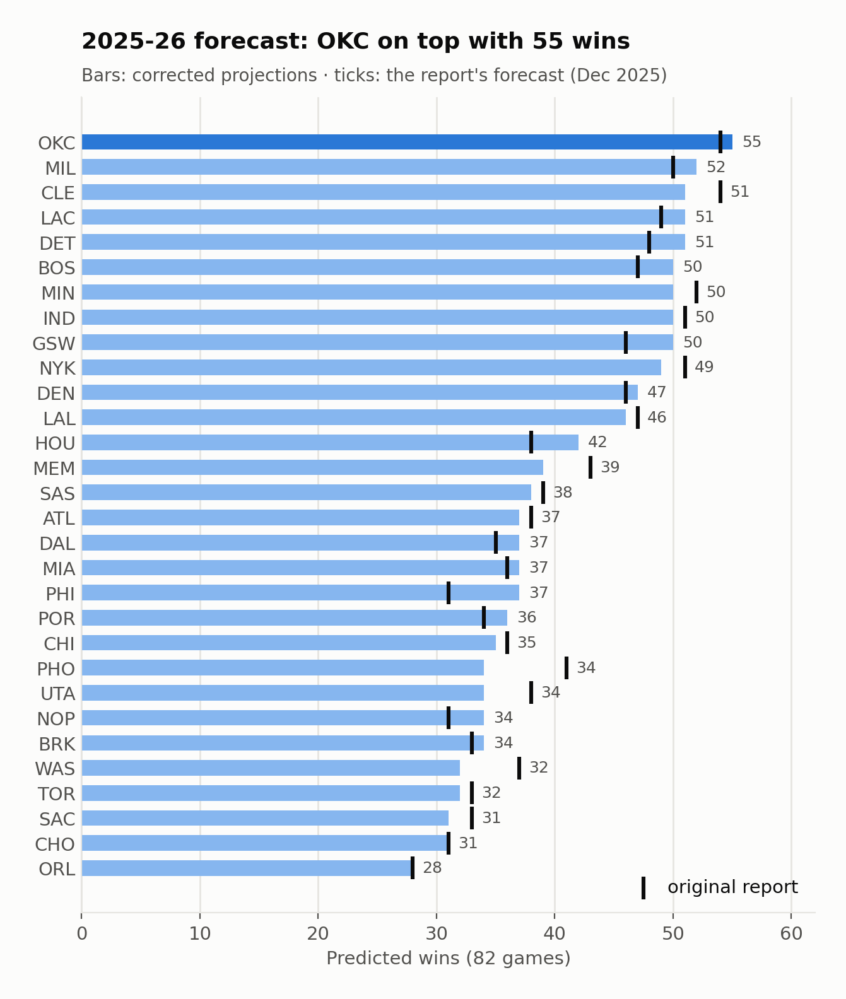
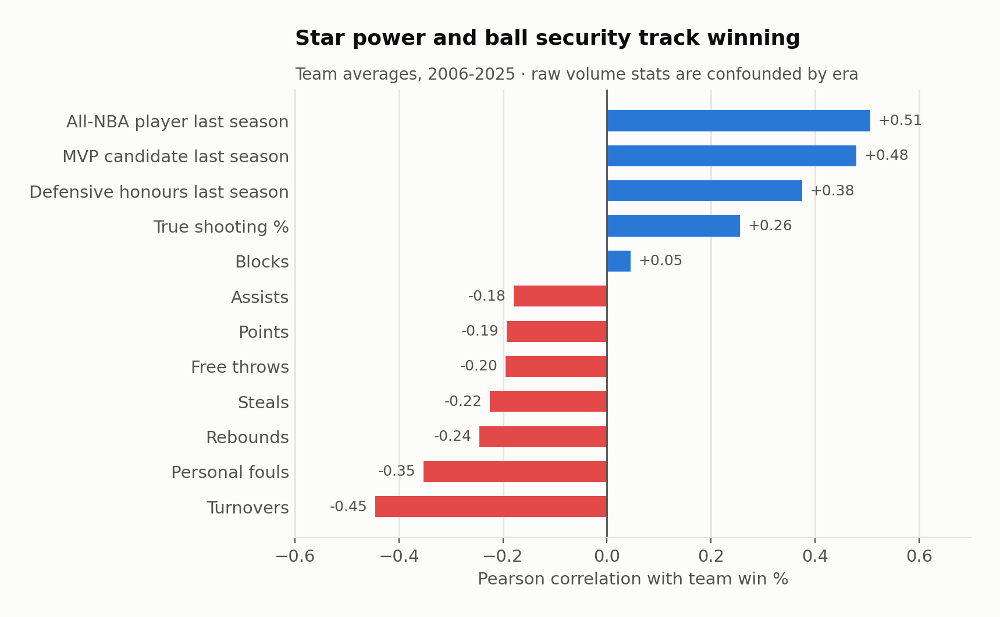
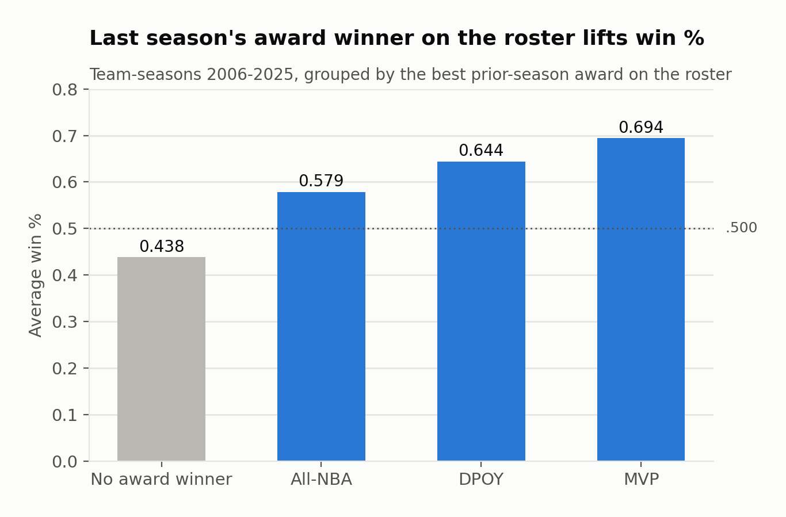
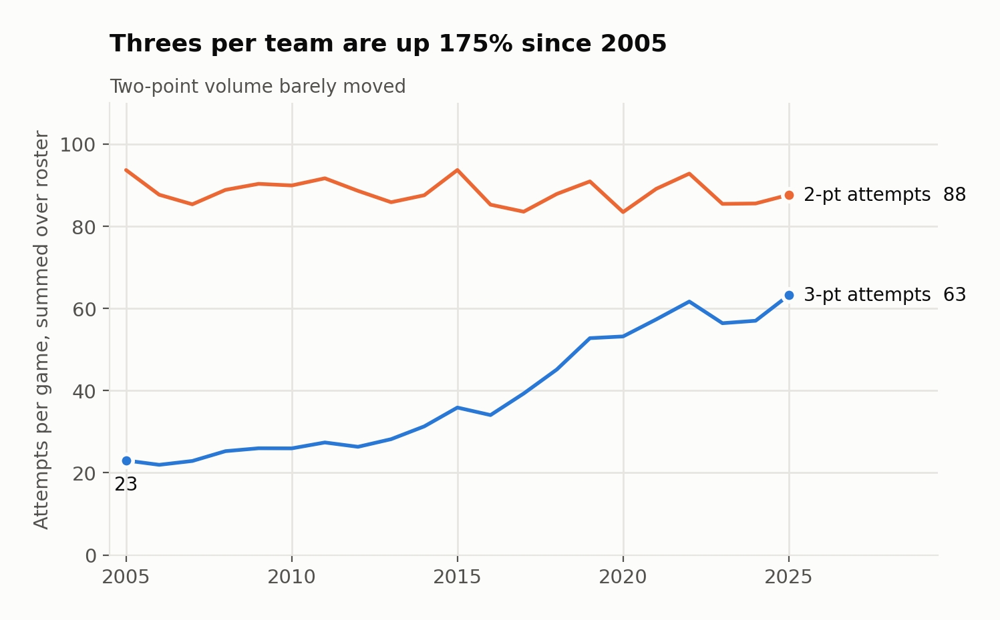
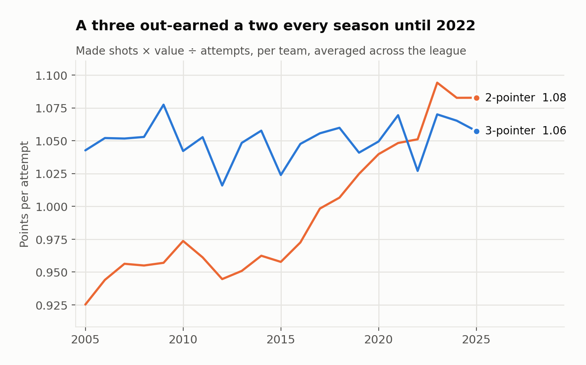
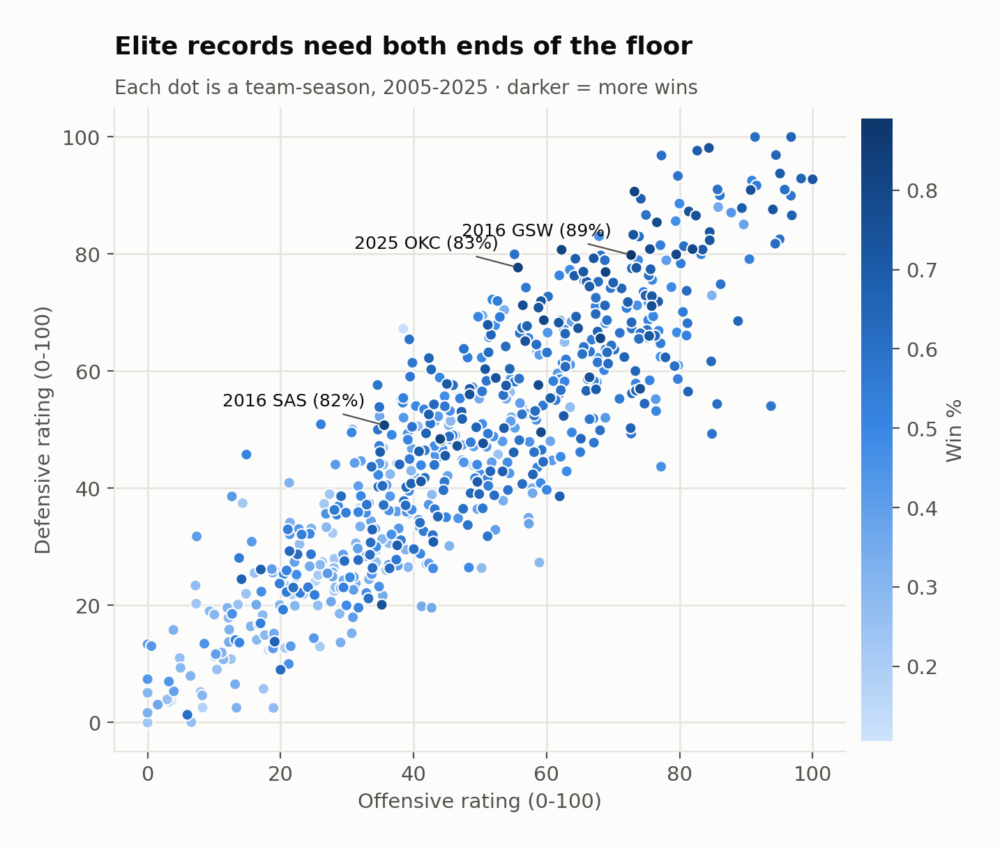
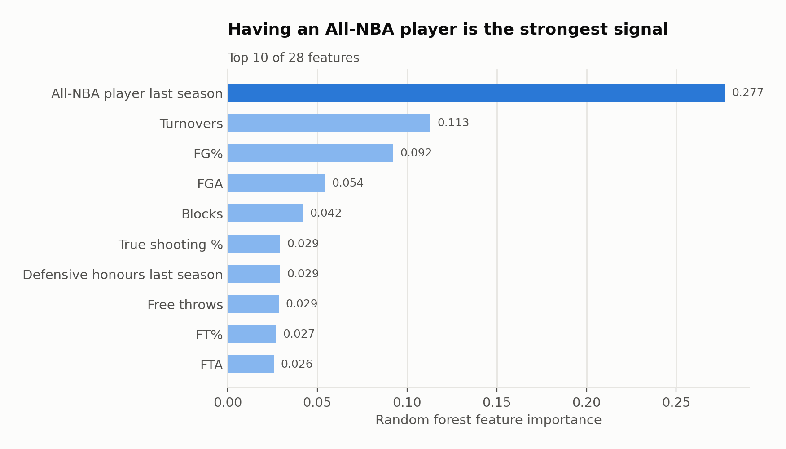
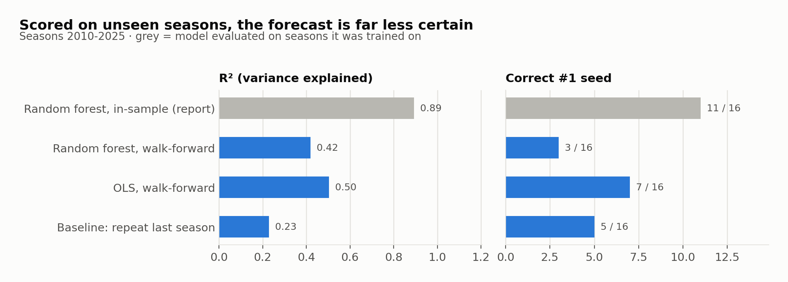
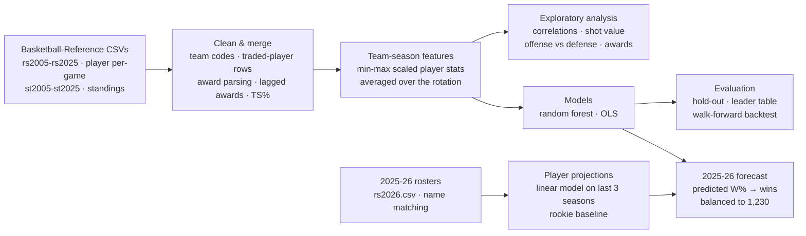

# Predicting the NBA regular season from box scores

**Can 20 years of player stats tell you who will finish first?** This project cleans 21 seasons of
Basketball-Reference data, finds which statistics actually move with winning, and trains a random
forest and an OLS regression to forecast the **2025-26 standings**. It then checks how much of that
accuracy survives on seasons the model has never seen.


<p align="center"></p>

| | |
|---|---|
| **Data** | 10,473 player-seasons and 630 team-seasons, 2004-05 to 2024-25 |
| **Forecast** | Oklahoma City has the best record (55-27), followed by Milwaukee (52) and Cleveland, the Clippers and Detroit (51). The original report had Cleveland and Oklahoma City tied at 54 |
| **Best predictor** | Having an All-NBA player from last season (27.7% of random-forest importance) |
| **Reported accuracy** | Random forest R² 0.44 on a random hold-out. It picks the league leader in 13 of 20 seasons, but only when scored on seasons it was trained on |
| **Honest accuracy** | Trained only on past seasons, OLS reaches R² 0.50 and picks 7 of 16 leaders. The random forest reaches 0.42 and 3 of 16, and a "repeat last season" baseline 0.23 and 5 of 16 |

---

## What drives winning

<table>
<tr>
<td width="50%"></td>
<td width="50%"></td>
</tr>
<tr>
<td><b>Star power and ball security matter most.</b> Last season's All-NBA (+0.51) and MVP-vote (+0.48) players correlate most strongly with win %. Turnovers (−0.45) and fouls (−0.35) hurt. Raw points and rebounds correlate <i>negatively</i> because scoring inflated across eras.</td>
<td><b>A prior-season MVP is worth about +.250 in win %.</b> Teams with last year's MVP averaged a .694 win %, versus .438 for teams with no prior-season award winner. This is why lagged awards are model features.</td>
</tr>
<tr>
<td></td>
<td></td>
</tr>
<tr>
<td><b>The three-point revolution, measured.</b> Threes per team rose 175% (23 → 63), and their share of shots went from 19% to 43%.</td>
<td><b>It was rational.</b> Per attempt, a three earned more than a two in every season from 2005 to 2021. Twos have edged ahead only since 2022 (1.08 vs 1.06 points in 2025). Still, a team's three-point <i>share</i> barely tracks its record (r = 0.12).</td>
</tr>
<tr>
<td></td>
<td></td>
</tr>
<tr>
<td><b>Elite teams win at both ends.</b> The offensive and defensive composites correlate with win % about equally (0.55 and 0.58). The best records sit top-right, and a few defense-first teams (2016 Spurs, 2025 Thunder) got there with only an average offense.</td>
<td><b>What the random forest leans on.</b> All-NBA presence captures the <i>depth</i> of a roster's talent better than a single MVP flag. Turnovers and shooting efficiency come next.</td>
</tr>
</table>

## How good is the forecast, really?

The original report scored its leader predictions with a model trained on those same seasons.
[Notebook 3](notebooks/03_out_of_sample_audit.ipynb) re-scores it with a **walk-forward backtest**:
for every season from 2010 to 2025, the models are trained only on earlier seasons.

<p align="center"></p>

- **Most of the forest's in-sample accuracy is memorisation.** On unseen seasons it picks fewer
  league leaders than simply repeating last season's standings.
- **The simpler OLS generalises better**, which reverses one of the report's conclusions.
- **Box scores and prior awards still carry real signal.** On R², win error and rank error, both models clearly beat the baseline.

## Audit: what changed from the original analysis

Porting the group's Colab notebooks into tested modules surfaced a few issues. Each fix is an option in
the code, so the [report's numbers are still reproducible](notebooks/02_model_and_forecast.ipynb)
(and pinned by tests) alongside the corrected ones.

| Issue in the original | Effect | Fixed result |
|---|---|---|
| 118 of 522 names on the 2025-26 rosters didn't match the stats history (typos, missing accents, a trailing space after "Victor Wembanyama") | Wembanyama, Towns, Bridges, Şengün and others projected as 10-point rookies | Forecast leader unchanged (OKC). Cleveland drops from 54 to 51 wins |
| Player projections trained on the all-zero 2026 rows | projected stats biased toward zero | trained on real seasons only |
| Points per attempt averaged players' shooting percentages | players with no threes count as 0% shooters, so twos looked better in every season | threes were worth more until 2021 |
| Traded players' season totals kept as a pseudo-team | league averages double-counted traded players | small shifts (3PA growth +171% → +175%) |
| Model scored on its own training seasons | 13/20 leaders looked like forecasting skill | walk-forward backtest above |

The full list, including the True Shooting formula and award parsing, is in the
[audit log](notebooks/03_out_of_sample_audit.ipynb). None of the fixes changes the evaluation results by more
than the season-to-season noise.

## Pipeline



## Repository layout

```
data/
  raw/               21 seasons of player + standings CSVs, 2025-26 opening rosters
  processed/         team_seasons.csv: the model's feature table (630 × 32)
notebooks/
  01_data_and_eda.ipynb          cleaning + exploratory questions
  02_model_and_forecast.ipynb    the report's models reproduced, 2025-26 forecast
  03_out_of_sample_audit.ipynb   walk-forward backtest, baseline, audit log
src/nba/
  data.py    load / clean / merge          eda.py    exploratory computations
  model.py   features, models, forecast    plots.py  figure styling
reports/     predictions_2026.csv · predictions_2026_report.csv · evaluation.csv
figures/     charts used in this README
tests/       33 tests pinning the report's numbers and the corrected results
```

## Run it

Each notebook has an **Open in Colab** badge at the top. To run locally:

```bash
git clone https://github.com/twillixa/NBA-Analysis && cd NBA-Analysis
python -m venv .venv && source .venv/bin/activate
pip install -r requirements.txt
pytest -q                                   # 33 tests, ~10 s
jupyter nbconvert --to notebook --execute --inplace notebooks/*.ipynb
```

## Data

Player per-game statistics and standings come from [Basketball-Reference](https://www.basketball-reference.com).
The site blocks automated scraping, so the files were downloaded manually. They remain subject to
[Sports Reference's terms of use](https://www.sports-reference.com/termsofuse.html). A season is
named by the year it ends (2025 = 2024-25). `rs2026.csv` holds the 2025-26 opening-night rosters
compiled by the team.

## Limitations and next steps

- Box scores and awards explain roughly half of the variance in win %. Injuries, trades, schedule
  and coaching sit outside the data, and the forecast treats opening-night rosters as fixed for the season.
- Each projected stat comes from its own linear model on the last three seasons, and every newcomer
  gets the same flat rookie line.
- Players are matched by name. Basketball-Reference player IDs would be more robust.
- Next steps:
  - choose models by walk-forward error
  - add possession-based (pace-adjusted) offense and defense ratings
  - score the 2025-26 forecast against the final standings

## Team

Data Science course project (2025-26), report dated December 22, 2025, by **Mila Stojanovic,
Mohamed Ben Moctar, Mizuki Oelhafen and Mahdere Tesfamichael**. The original Colab notebooks live in
[maadmaaax/Project_NBA_GroupM](https://github.com/maadmaaax/Project_NBA_GroupM). This repository is a
tested, modular port of them, with the out-of-sample evaluation and the fixes above added.

Code is released under the [MIT License](LICENSE).
